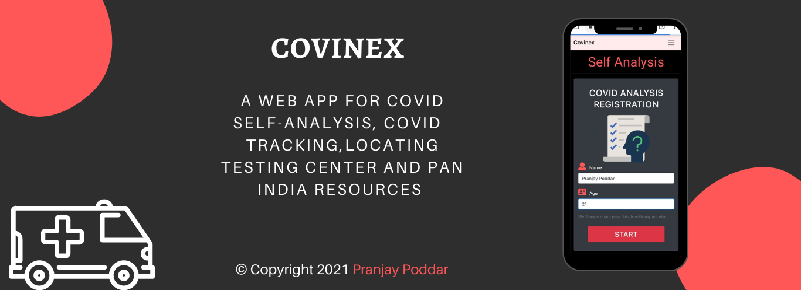

# Covinex
Hosted Link To Website- https://covinex.netlify.app

A Covid-19 web-app, which enables users to access some outstanding features like self-analysis for covid testing, Covid case tracker at global and country level, locating testing centers, and most importantly I have collated Pan-India resources like available hospital beds, contact information of oxygen cylinder distributors, plasma doners and medical assistance which are regularly updated.
 

   

 

 
<h4 align="center">Completely Responsive For Std Sized Screens:</h4>

 

## List Of Features
* The main feature of this application is that it has simple and user understandable questions with the help of their answers user can deduce whether he/she needed to be tested for covid-19 or not.
*  If the user has to go for testing, the user can pre-register for the covid-19 testing in there nearby location.
*  A global Covid tracker in which live tracking of active, deceased and recovered count of patients can be viewed.
*  A Country Wise Covid tracker in which live tracking of active, deceased and recovered count of patients for a specific country can be viewed.
*  Resources from Pan Indian which are updated regularly.
* An interactive Chat Bot to solve User Queries.

## Installation And Project Setup
This project was generated with [Angular CLI](https://github.com/angular/angular-cli) version 11.2.1.

## Development server
Run `ng serve` for a dev server. Navigate to `http://localhost:4200/`. The app will automatically reload if you change any of the source files.

## Code scaffolding  
Run `ng generate component component-name` to generate a new component. You can also use `ng generate directive|pipe|service|class|guard|interface|enum|module`.

  

## Build
Run `ng build` to build the project. The build artifacts will be stored in the `dist/` directory. Use the `--prod` flag for a production build.

## Running unit tests
Run `ng test` to execute the unit tests via [Karma](https://karma-runner.github.io).

## Running end-to-end tests
Run `ng e2e` to execute the end-to-end tests via [Protractor](http://www.protractortest.org/).

## Further help
To get more help on the Angular CLI use `ng help` or go check out the [Angular CLI Overview and Command Reference](https://angular.io/cli) page.

## Release History
-   0.1
    -   Initial Version
-   0.2
    -   New look!
-   0.3
    -   Update In Country Level Tracker
-   0.4
    -   Work in progress

## Author
Pranjay Poddar - pranjaypoddar@outlook.com
Distributed under the MIT License

Copyright (c) 2021 Pranjay Poddar

* Permission is hereby granted, free of charge, to any person obtaining a copy of this software and associated documentation files (the "Software"), to deal in the Software without restriction, including without limitation the rights to use, copy, modify, merge, publish, distribute, sublicense, and/or sell copies of the Software, and to permit persons to whom the Software is furnished to do so, subject to the following conditions:

* The above copyright notice and this permission notice shall be included in all copies or substantial portions of the Software.

THE SOFTWARE IS PROVIDED "AS IS", WITHOUT WARRANTY OF ANY KIND, EXPRESS OR IMPLIED, INCLUDING BUT NOT LIMITED TO THE WARRANTIES OF MERCHANTABILITY, FITNESS FOR A PARTICULAR PURPOSE AND NONINFRINGEMENT. IN NO EVENT SHALL THE

AUTHORS OR COPYRIGHT HOLDERS BE LIABLE FOR ANY CLAIM, DAMAGES OR OTHER LIABILITY, WHETHER IN AN ACTION OF CONTRACT, TORT OR OTHERWISE, ARISING FROM, OUT OF OR IN CONNECTION WITH THE SOFTWARE OR THE USE OR OTHER DEALINGS IN THE SOFTWARE.

## Contributing
1.  Fork it ([https://github.com/pranjay-poddar/Covinex.git](https://github.com/pranjay-poddar/Covinex.git))
2.  Create your feature branch (`git checkout -b feature/xyz`)
3.  Commit your changes (`git commit -am 'Add some xyz'`)
4.  Push to the branch (`git push origin feature/xyz`)
5.  Create a new Pull Request
 
<h4 align="center">
© Pranjay Poddar 2021
</h4>