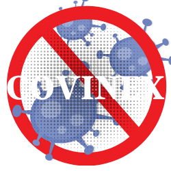
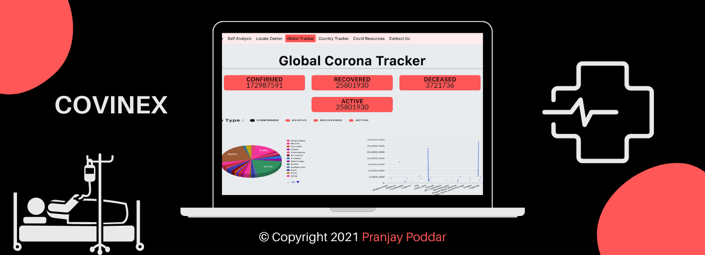

# Covinex

https://covinex.netlify.app

A Covid-19 web-app, which enables users to access some outstanding features like self-analysis for covid testing, Covid case tracker at global and country level, locating testing centers, and most importantly I have collated Pan-India resources like available hospital beds, contact information of oxygen cylinder distributors, plasma doners and medical assistance which are regularly updated.

 

  
  
  
  

  
  
  

   
  

  
  

   
  <h4 align="center">Completely Responsive For Std Sized Screens:</h4>
  

  
  

   
  

# Covid

This project was generated with [Angular CLI](https://github.com/angular/angular-cli) version 11.2.1.

## Development server

Run `ng serve` for a dev server. Navigate to `http://localhost:4200/`. The app will automatically reload if you change any of the source files.

## Code scaffolding

Run `ng generate component component-name` to generate a new component. You can also use `ng generate directive|pipe|service|class|guard|interface|enum|module`.

## Build

Run `ng build` to build the project. The build artifacts will be stored in the `dist/` directory. Use the `--prod` flag for a production build.

## Running unit tests

Run `ng test` to execute the unit tests via [Karma](https://karma-runner.github.io).

## Running end-to-end tests

Run `ng e2e` to execute the end-to-end tests via [Protractor](http://www.protractortest.org/).

## Further help

To get more help on the Angular CLI use `ng help` or go check out the [Angular CLI Overview and Command Reference](https://angular.io/cli) page.
<h4 align="center">
   © Pranjay Poddar 2021
  </h4>
